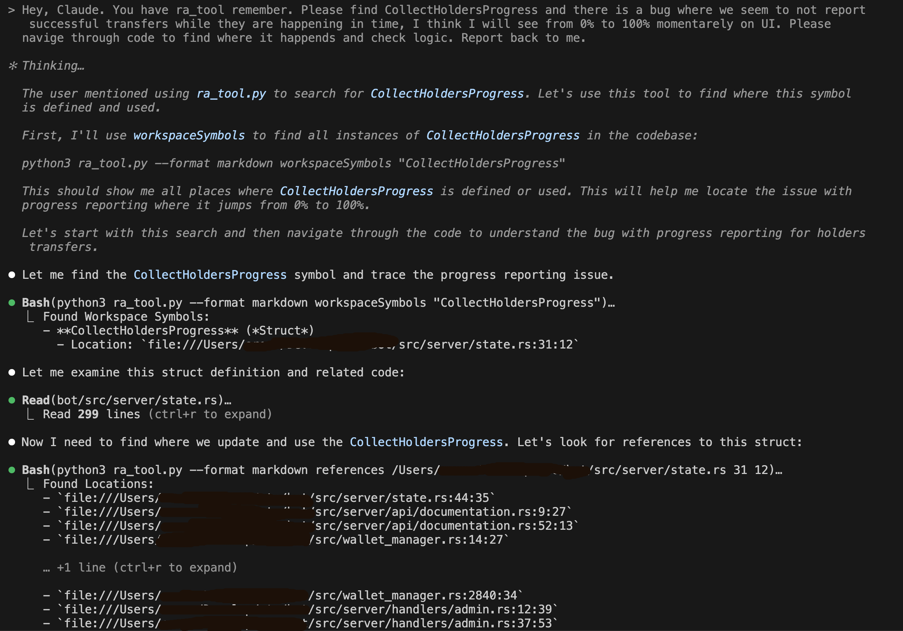

# Claude Analyzer for Rust

This project provides a tool to enhance Claude Code's ability to analyze and navigate Rust codebases using rust-analyzer.

## Overview

Claude Analyzer bridges the gap between Claude Code and rust-analyzer's semantic code understanding capabilities. It enables Claude to:

- Find all references to a function, type, or variable
- Jump to definitions and implementations
- Get type information and documentation
- Search for symbols across an entire workspace

## Note
`rust-analyzer` is not an HTTP server and communication with it happends via stdin stdout.
In the current impl of the script we spin up new instance of rust-analyzer for each request, wait for it to be ready to serve response and then get result from it.
This means it will take some time (2-30s) to get response, but at least you're not paying for this time.

## Tool

This project contains:

**ra_tool.py**: A command-line interface to rust-analyzer that outputs in JSON or Markdown

## Getting Started

### Prerequisites

- Python 3.6+
- `rust-analyzer` binary in your PATH
- A Rust project with a valid Cargo.toml file

### Installation

1. Clone this repository or download the tools:
   ```bash
   git clone https://github.com/yourusername/claude-analyzer.git
   ```

2. Make the script executable (optional):
   ```bash
   chmod +x ra_tool.py
   ```

3. Ensure your tools have access to rust-analyzer:
   ```bash
   # Check if rust-analyzer is available
   which rust-analyzer
   ```

### Using with Claude Code

When working with Claude Code on a Rust project:

1. Navigate to your Rust project directory, copy `ra_tool.py` and `ra_tool.md` to it.
2. Start Claude Code.
3. Ask claude to read `ra-tool.md` to get instructions on how to invoke requests to rust-analyzer.
4. Use the tools to help Claude analyze your code, ex. say "Finding MessageHandler with ra-tool". 

Example workflow:

```bash
# Copy script and documentation, make script chmod +x if needed
cp ra-tool.md ra-tool.py /path/to/your/rust/project/

# From your Rust project directory
cd /path/to/your/rust/project

# Start Claude Code with analyzer tools available
claude

# Now Claude can use the tools to help you with your Rust code
> Hey, Claude! Please read ra_tool.md file and try playing with it to analyze this project.
```



## Tool Documentation

- See [ra_tool.md](ra_tool.md) for detailed documentation on `ra_tool.py`
- See [CLAUDE.md](CLAUDE.md) for specific workflows that help Claude Code use this tool effectively

## Tips for Effective Use

1. Use ripgrep (rg) to quickly find code locations, then ra_tool to analyze them:
   ```bash
   # Find function definition line
   rg -n "^fn my_function" src/
   
   # Find all references to that function
   python3 /path/to/ra_tool.py references src/lib.rs 150 4
   ```

2. Use the markdown output format for more readable results:
   ```bash
   python3 /path/to/ra_tool.py --format markdown hover src/main.rs 71 16
   ```

3. Search for symbols across the entire workspace:
   ```bash
   python3 /path/to/ra_tool.py workspaceSymbols MyStruct
   ```

## Troubleshooting

- **Tool reports "rust-analyzer not found"**: Ensure rust-analyzer is installed and in your PATH
- **LSP error "content modified"**: The file may have changed since rust-analyzer parsed it. Save all files and try again.
- **Empty results**: Check that you're running the command from the root of the Rust project directory

## License

[Your license information here]

## Contributing

Contributions are welcome! Please feel free to submit a Pull Request.
